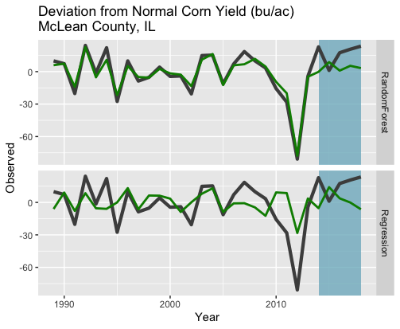

# standardized-precipitation-index
#### Analyze drought in the contiguous United States with the Standardized Precipitation Index (SPI)

downloadPrecip.R - download precipitation data from NOAA Climate Prediction Center (does not require wget -- probably much easier to use wget instead)

calcSPI.R - calculate the Standardized Precipitation Index

plotSPI_simple.R - make a simple map of the SPI (good for sanity checks of calcSPI) 

plotSPI_leaflet.R - create an interactive map of the SPI using Leaflet

spi_shiny_app/app.R - turn the Leaflet map into an interactive web app using Shiny.  This web app is running here: https://chenerous.shinyapps.io/spi_shiny_app/

forecastYield.R - use SPI to predict corn yields in the US using a stepwise linear regression and a random forest method and compare the results:

